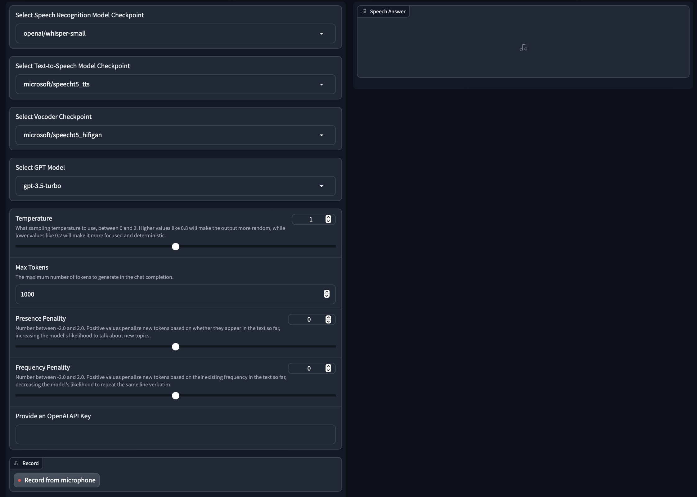

# GIVA - GPT-based Vocal Virtual Assistant

## Overview

GIVA is a vocal assistant that combines speech recognition and text-to-speech with the capabilities of GPT (3.5-turbo or 4). Prompts are engineered so that GPT provides outputs that are short and adapted to be converted to audio.

## Features:
- **Speech Recognition**: GIVA employs the `openai/whisper` model for accurate transcription of speech inputs. It's possibile to choose between the tiny, small, medium, and large v2 versions of the mdoel.
- **GPT Chat Completion**: The user can choose between GPT-3.5-turbo and GPT-4 to interact with the vocal assistant.
- **Possibility to Operate on GPT Parameters**: The user can operate on parameters such as **Temperature**, **Presence**, and **Frequency**
- **Text-to-Speech**: With the `microsoft/speecht5_tts` model, GIVA generates an audio output.
- **Interactive Interface**: The application consists of two tabs. The first tab exclusively presents the audio output, while the second tab provides additional information, including the output of Automatic Speech Recognition (ASR) and the responses generated by GPT.

## ASR Models:
The user can select from different ASR models, such as:
- [OpenAI Whisper-tiny](https://huggingface.co/openai/whisper-tiny)
- [OpenAI Whisper-small](https://huggingface.co/openai/whisper-small)
- [OpenAI Whisper-medium](https://huggingface.co/openai/whisper-medium)
- [OpenAI Whisper-large-v2](https://huggingface.co/openai/whisper-large-v2)

## GPT Models
The user can select from different ASR models, such as:
- GPT-3.5-turbo
- GPT-4

## GPT Parameters
The user can operate on:
- Temperature
- Presence Penality
- Frequency Penality
- Maximum Number of Tokens

## References:
- [OpenAI Whisper-base](https://huggingface.co/openai/whisper-tiny)
- [Microsoft SpeechT5_tts](https://huggingface.co/microsoft/speecht5_tts)
- [Matthijs, Huggingface - Speech Synthesis, Recognition, and More With SpeechT5](https://huggingface.co/blog/speecht5)
- [Huggingface - ASR with Transformers](https://huggingface.co/docs/transformers/tasks/asr)
- [OpenAI API Reference](https://platform.openai.com)

